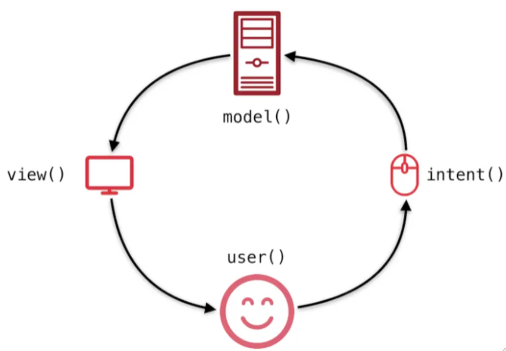
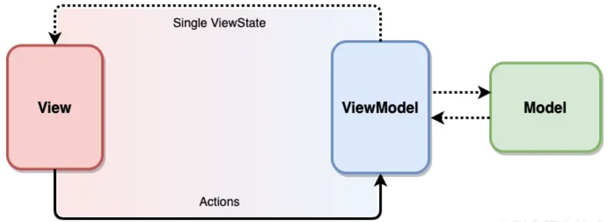

# mviSample

使用MVI架構實作Android APP

# Describe

MVI架構與MVVM很相似，也可以MVI視為MVVM架構優化。與MVVM不同，MVVM強調UI與資料雙向綁定，而MVI則是強調單向流動。


## 資料流程



1. 畫面以Intent的形式通知Model

2. Model根據Intent進行State更新
   
3. View已訂閱的方式接收State狀態變更，並進行UI更新。

## MVI組成

1. Model: 與MVVM中的Model不同，MVI中的Model代表的是UI狀態(MVVM中的ViewModel)。

2. View:用戶介面，在Android中Activity或Fragment都可以是View。與MVVM一樣MVI的View一樣都是透過訂閱方式來進行UI狀態變更。

3. Intent:非Android中的Intent，這邊Intent的指的示意圖，UI上的任意操作都包裝Intent後傳送給ViewModel。



## Example

***Intent***

```kotlin
sealed class MainIntent {
    object GetUser : MainIntent()
}
```

***State***

```kotlin
sealed class MainState {
    data class User(
        val id: Int = 0,
        val name: String = "",
        val email: String = "",
        val avatar: String = ""
    ) : MainState()
}
```

***ViewModel***

```kotlin
class MainViewModel() : ViewModel() {
    private val _viewStates: MutableLiveData<MainState> = MutableLiveData()
    val viewStates = _viewStates
    fun dispatch(intent: MainIntent) {
        when (intent) {
            is MainIntent.GetUser -> {
                viewStates.value = MainState.User(
                    id = 1,
                    name = "John",
                    email = "John@test.com",
                    avatar = "John avatar"
                )
            }
        }
    }
}
```

***View***

將行為包裝成Intent並發送給ViewModel

```kotlin
btn.setOnClickListener {
    viewModel.dispatch(MainIntent.GetUser)
}
```

在view中以訂閱方式進行資料更新

```kotlin
viewModel.viewStates.observe(this) {
    when(it) {
        is MainState.User -> {
            Log.d("mviSample", "User:$it")
        }
    }
}
```

## 結論

從範例中可以發現與一般MVVM架構主要有兩點差異

1. 一般MVVM架構中View通知ViewMode，通常會用一個變數來表示UI裝態變更，但當UI很複雜時就會出現ViewModel中很多用來表示UI狀態變數。而再MVI中View通知ViewMode狀態變更是以Intent方式進行，而Intent會以密封類表示。
MVVM中ViewModel上會有很多用來表示UI狀態變數的問題，當初就提出使用狀態機(EX: Loading、Loaded、Loging、Login Success或Loging fail...等將UI行為視為一種狀態)就可以解決這個問題。

2. 與Intent包裝行為樣的想法，建立一個State的密封類，ViewModel更新資料時就只需針對State的資料進行更新就可以了

3. 除了用常見call mathod方式通知ViewMode UI狀態變更之外，也可以使用kotlin中的chanel，來進行View去通知ViewMode。
